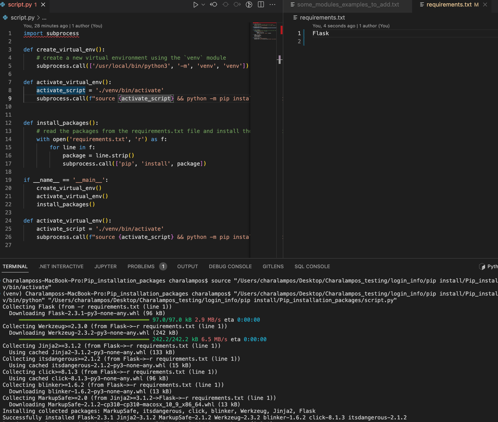

# Automating Virtual Environment Creation and Package Installation using Python
Overview

This is a simple DevOps project in Python that automates the process of creating a virtual environment and installing packages using pip. The project includes a Python script that reads a requirements.txt file and installs the packages listed in it within a virtual environment.
Why Use Virtual Environments?

Virtual environments are an important tool in Python development because they allow you to isolate different projects and their dependencies, and manage them separately. This makes it easier to manage dependencies, avoid version conflicts, and keep your system clean and organized.
How to Use the Project

To use this project, follow these steps:

    Create a new directory for your project and navigate to it in your terminal.
    Create a new file named requirements.txt in your project directory and add the packages you want to install, one per line.
    Copy the install.py file from this project into your project directory.
    Run the install.py script using the command python install.py.

The script will create a new virtual environment, activate it, and install the packages listed in requirements.txt. If you want to install additional packages later, simply add them to the requirements.txt file and run the install.py script again.
Conclusion

This project provides a simple way to automate the process of creating a virtual environment and installing packages using pip. By using virtual environments, you can isolate your project's dependencies and manage them separately from other Python projects on your system.

If you have any questions or feedback, please feel free to reach out!

Below you see a sample screenshot of how it works.

